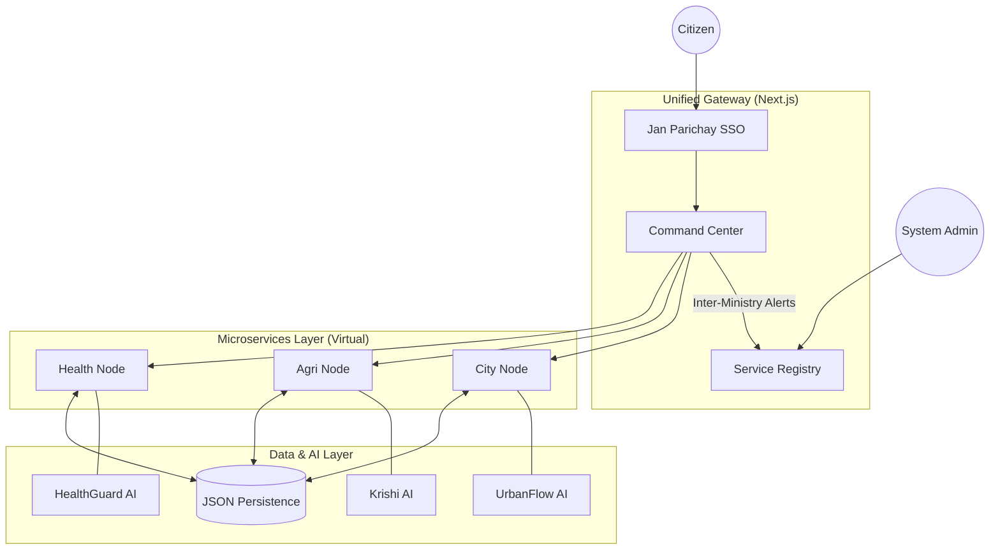

# National DPI Ecosystem (Hackathon Prototype)

A scalable, AI-integrated Digital Public Infrastructure (DPI) connecting Healthcare, Agriculture, and Smart City services under a unified command center.

## 🚀 Key Features (Winning Differentiators)

### 1. Unified Command Center (`/dashboard`)
- **Real-time Monitoring**: Visualize system health, latency, and active nodes.
- **Voice-Activated Search**: Filter services using voice commands (Accessibility).
- **Scalability Simulator**: "Turbo Mode" toggle demonstrating Edge Caching (Performance).

### 2. AI-Driven Decision Support
- **Krishi AI Doctor** (`/services/agriculture`): Diagnoses crop diseases from images.
- **HealthGuard AI** (`/services/healthcare`): Predicts epidemic outbreaks (e.g., Dengue) using vector data.
- **UrbanFlow AI** (`/services/city`): Optimizes traffic signals to reduce congestion.

### 3. Cross-Ministry Interoperability
- **Data Exchange Bus**: Seamlessly shares critical alerts between ministries (e.g., Health Dept notifying City Corp about vector risks).
- **Service Registry**: Auto-discovery of new service nodes.

## 🏗️ System Architecture



### 4. Resilience & Inclusion
- **Unified Citizen Profile** (`/profile`): Holographic Digital ID with consolidated service records.
- **Offline/Lite Mode**: Agriculture portal works on 2G networks (Text-only mode).
- **Localization**: Dashboard available in English, Hindi, and Gujarati.

## 🛠️ Tech Stack
- **Framework**: Next.js 14 (App Router)
- **Styling**: Tailwind CSS + Lucide Icons + Framer Motion (Animations)
- **Persistence**: File-system JSON Database (Portable & Fast)
- **Charts**: Recharts
- **Security**: Simulated Jan Parichay (SSO) & WAF Logging

## 🏃‍♂️ Setup Instructions

1. **Install Dependencies**:
   ```bash
   npm install
   # or
   pnpm install
   ```

2. **Start the Platform**:
   ```bash
   npm run dev
   ```

3. **Open Access Points**:
   - **Dashboard**: [http://localhost:3000/dashboard](http://localhost:3000/dashboard)
   - **Healthcare**: [http://localhost:3000/services/healthcare](http://localhost:3000/services/healthcare)
   - **Admin Console**: [http://localhost:3000/admin](http://localhost:3000/admin)

## 📂 API Documentation
The platform exposes RESTful endpoints for interoperability:
- `GET /api/registry/services` - List all active nodes.
- `POST /api/interop/alerts` - Broadcast cross-ministry alerts.
- `POST /api/city/complaints` - File a public grievance.
- `GET /api/agriculture/rates` - Fetch APMC Mandi rates.

## 🔒 Security & Compliance
- **Identity**: "Jan Parichay" integration mock.
- **Audit Logs**: View security events at `/admin`.
- **Privacy**: Consent-based data sharing implemented in Healthcare portal.
